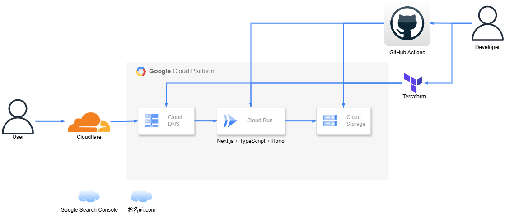

# 自己紹介用のWebアプリケーション(リニューアル)

## Summary

- 私の自己紹介サイトをリニューアルしました。

- 以下が解消されました。
    - Compute Engine → Cloud Runによりコスト削減
    - Let’s Encrypt → Cloudflareによりセキュリティ強化
    - CloudFunctions →　Honoによりバックエンド非公開の解消
    - Mailjet →　Resendによりメール送信方法の統一化

## Site

以下URLで公開しています。

[該当サイト](https://introtechkk.com/)

## Tech Stack

## Architecture

## Environment

環境変数は以下ファイルを参照してください。

[Environment](./manuals/environments.md)

## Archived

アーカイブ用リポジトリは以下になります。
※非公開分は未記載。

[Web側リポジトリ](https://github.com/kojikawazu/archived-next-ts-intro-web-app)
